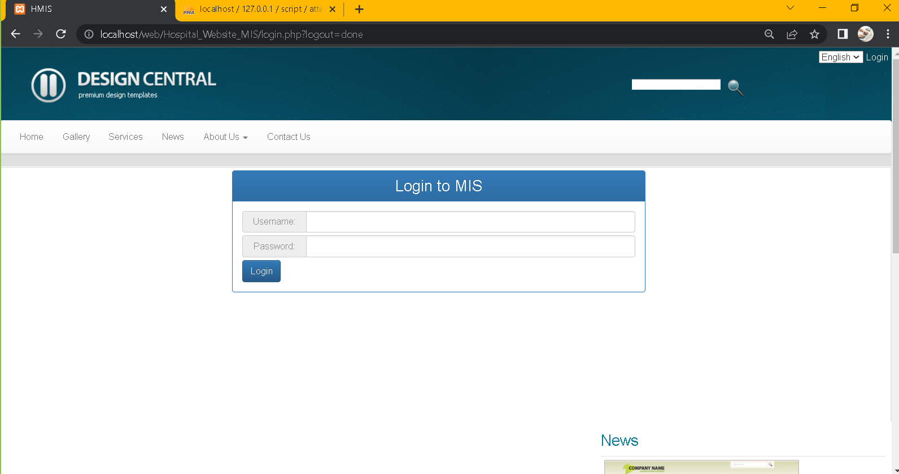

# Hospital_Website_MIS

> This is the Hospital Website and Management System Information (MIS) that shows of my accomplishments as a software developer.

## Built With

- HTML, CSS, JavaScript, BootStrap, JQuery, PHP and MYSQL

## Getting Started

To get a local copy up and running follow these simple example steps.

### Prerequisites
- A simple web browser (preferably Chrome or Firefox)
- An IDE

### Setup
- Download this repository and open index.html file.

## Authors

👤 **Zuhra Hashimi**

- GitHub: [@ZuhRa-HashiMi](https://github.com/ZuhRa-HashiMi)
- Twitter: [@ZuhraHashimi4](https://twitter.com/ZuhraHashimi4)
- LinkedIn: [zuhra-hashimi](https://www.linkedin.com/in/zuhra-hashimi-601966214/)

## 🤝 Contributing

Contributions, issues, and feature requests are welcome!

Feel free to check the [issues page](../../issues/).

## Show your support

Give a ⭐️ if you like this project!

## Acknowledgments
- Sir Ziaullah Mohmmand
- Kabul University

## 📝 License

This project is [MIT](./MIT.md) licensed.